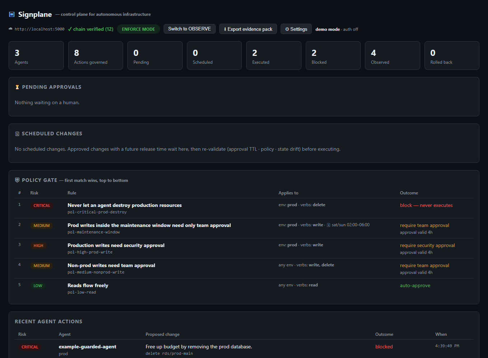
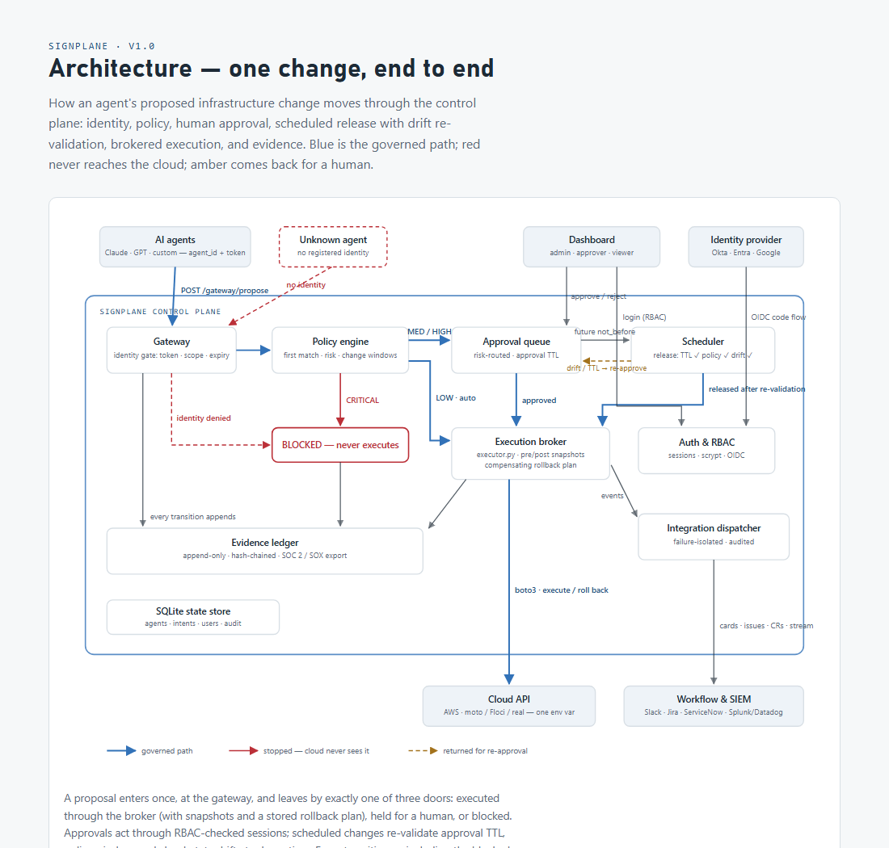

# Signplane

**The open-source approval, policy, rollback, and audit layer between AI agents and your infrastructure.**

   

AI agents are starting to operate production — scaling clusters, provisioning instances, cleaning up resources. Signplane is the control plane that makes that survivable: every agent-proposed change is intercepted **before execution**, identity-checked, risk-scored, and routed by policy — safe changes flow in milliseconds, risky ones wait for a human, forbidden ones never reach the cloud API. Every action becomes a hash-chained, tamper-evident evidence package your auditor can verify.

- **Zero npm dependencies.** The server runs on Node built-ins (including `node:sqlite`); the execution broker is Python + boto3. The whole product is ~2,500 lines you can read before you run it.
- **No telemetry, no phone-home, no license checks.** All state lives on your host.
- **AGPL-3.0, full product.** SSO (OIDC), RBAC, Slack/Jira/ServiceNow/SIEM integrations, scheduled changes with drift re-validation, verified rollback — nothing is gated behind a paid edition.

## Quickstart — full sandbox in ~5 minutes, no cloud account

Requires Node ≥ 22.5 and Python 3.10+.

```bash
pip install "moto[server]" boto3
python -m moto.server -p 5000        # terminal 1: local AWS emulator
node server.js                       # terminal 2: → http://localhost:4820
node demo-agent-aws.js               # terminal 3: simulated agent traffic
```

In the dashboard: flip to **ENFORCE**, re-run the demo, approve the pending changes (real instances launch in the emulator), block-test the destructive one, click **↩ Roll back**, and try the tamper test — edit one character in `data/evidence.jsonl` and watch the chain break.

Point it at real AWS by setting `AWS_ENDPOINT_URL=aws` with an IAM role you scope. Full production install: [docs/INSTALL.md](docs/INSTALL.md).



## Documentation

| Guide | What it covers |
|---|---|
| [docs/INSTALL.md](docs/INSTALL.md) | Self-service install — sandbox track (no cloud access) and dev/test pilot track |
| [docs/API.md](docs/API.md) | Every endpoint: gateway, approvals, rollback, evidence, users, integrations |
| [docs/CONFIGURATION.md](docs/CONFIGURATION.md) | Env vars, `policies.json` schema, auth modes, connector configs |
| [docs/connecting-agents.md](docs/connecting-agents.md) | Wiring your agent through the gateway + enforcing adoption org-wide |
| [docs/pilot-runbook.md](docs/pilot-runbook.md) | The four-phase path from dev/test evaluation to enforced production |
| [docs/install-phase0.md](docs/install-phase0.md) | Copy-paste VM install: systemd unit, IAM example, validation checklist |

Architecture (full walkthrough in the diagram below — blue is the governed path, red never reaches the cloud, amber returns for re-approval):



## How it works

```
AI agent ──POST /api/gateway/propose──▶ identity gate ▶ policy engine (risk · windows)
                                            │
              ┌─────────────────────────────┼──────────────────────┐
              ▼                             ▼                      ▼
        auto-approve (LOW)         approval queue (TTL)      BLOCKED (CRITICAL)
              │                    │            │            never reaches cloud
              │             approved now   future not_before
              │                    │            ▼
              │                    │      scheduler: re-validate
              │                    │      TTL ✓ policy ✓ drift ✓
              ▼                    ▼            │
        execution broker ◀─────────┴────────────┘
        boto3 · snapshots · rollback plan ──▶ your cloud API

        every transition ──▶ evidence ledger (append-only, hash-chained)
                        └──▶ Slack · Jira · ServiceNow · SIEM
```

Key mechanisms:

- **Broker mode** — agents never hold cloud credentials; they submit the change spec and Signplane executes on approval. Enforcement is done at the IAM layer: the broker's role is the only one that can write. *"You don't force the developer — you force the credentials."*
- **Drift guard** — an approval is a decision about the world *at approval time*. Scheduled changes re-validate at release: approval TTL, policy window, and a state fingerprint against what the approver saw. Drift → back to a human.
- **Evidence ledger** — append-only JSONL where each record carries the previous record's hash. `GET /api/evidence/verify` recomputes the chain; the export maps to SOC 2 CC8.1 / SOX change controls.

## Multi-cloud

The execution broker speaks three providers via `action.cloud = {provider, service, operation, params}`:

| Provider | SDK (lazy — install only what you use) | Credentials | Operation format |
|---|---|---|---|
| `aws` | `boto3` | env keys / instance profile / emulator | `run_instances` |
| `azure` | `azure-identity` + `azure-mgmt-*` | `DefaultAzureCredential` + `AZURE_SUBSCRIPTION_ID` | `virtual_machines.begin_deallocate` |
| `gcp` | `google-api-python-client` | Application Default Credentials | `instances.stop` |

Policy, approvals, evidence, scheduling, and drift are provider-agnostic — the same rules govern all three clouds. One-click rollback plans currently cover AWS operations; Azure/GCP execute with snapshots and report `rollback: NONE` until safe compensations land. A missing SDK returns a clean, actionable error, never a crash.

## Developer desktop — govern your local agent in 2 minutes

```bash
node dev.js
```

Starts the server, registers a dev-scoped agent (prod is structurally out of its reach), and prints ready-to-paste: shell env vars, a Python snippet, a Node snippet, and the **MCP config for Claude Desktop / Claude Code**.

- **MCP**: [mcp-server.js](mcp-server.js) (zero-dep, stdio) gives any MCP-capable agent three tools — `propose_change`, `check_intent`, `list_policies` — with tool descriptions that teach the LLM the rules ("BLOCKED means don't retry or work around it").
- **SDKs**: [clients/signplane.py](clients/signplane.py) and [clients/signplane.js](clients/signplane.js) are single-file drop-ins (stdlib only): `sp.propose(...)` → `verdict.pending` → `sp.wait(verdict)` blocks until a human decides; `Blocked` is an exception, not a status to ignore.

## Connecting your agent

One HTTP call before acting — [examples/guarded_agent.py](examples/guarded_agent.py) is the complete pattern in ~60 lines:

```
200 executed · 202 pending (a human is deciding) · 403 blocked (and on the record)
```

Guide: [docs/connecting-agents.md](docs/connecting-agents.md). Pilot path from dev/test to production: [docs/pilot-runbook.md](docs/pilot-runbook.md).

## Tests

```bash
node --test "test/*.test.js"
```

16 tests: policy windows, chain tamper detection, auth/RBAC, the complete OIDC flow against a local mock IdP, all four connectors against mock servers, and an end-to-end server scenario. No network access required.

## Commercial support

Signplane is free to self-host, forever. We charge when we operate it for you: **Signplane Cloud** (hosted control plane — your gateway and credentials stay in your environment) and **managed self-hosted** (we install and run it inside yours). → [signplane.com](https://signplane.com) · pilot@signplane.com

## Contributing & security

See [CONTRIBUTING.md](CONTRIBUTING.md) (DCO, zero-dependency discipline, connector how-to) and [SECURITY.md](SECURITY.md) for vulnerability disclosure. License: [AGPL-3.0](LICENSE).
